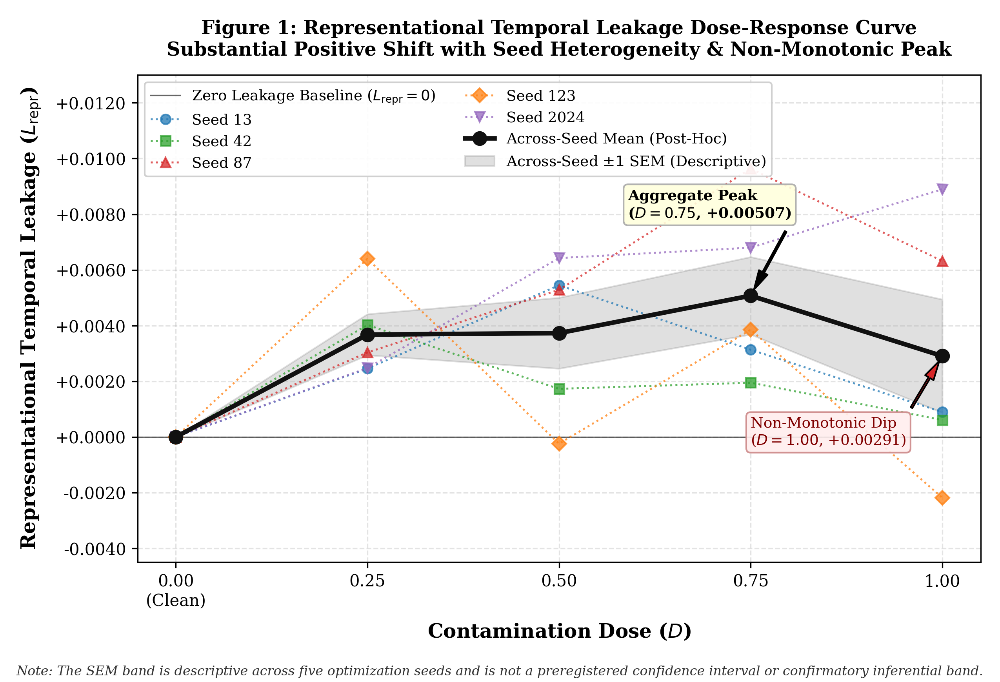
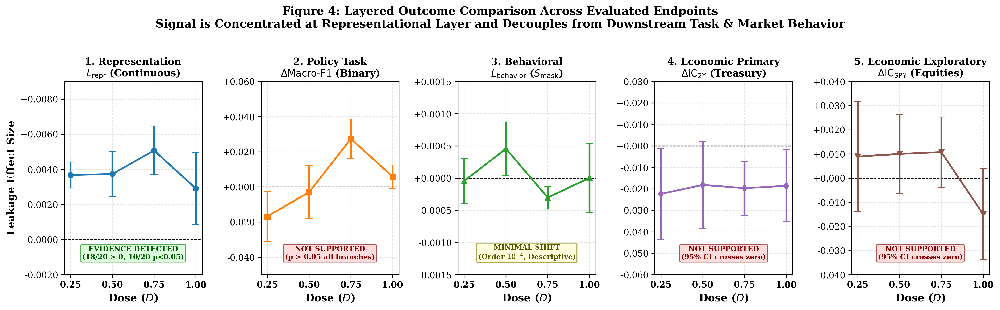

# MANTRA — Parametric Temporal Leakage Research Fork

> **This fork is no longer maintained as a user-facing trading-agent application tutorial.**  
> It has been repurposed into a reproducible research artifact for studying **parametric temporal leakage in financial language models**.

This repository began as a fork of [RubiscoYHY/MANTRA](https://github.com/RubiscoYHY/MANTRA), itself built on [TradingAgents](https://github.com/TauricResearch/TradingAgents). The upstream application code remains in the repository history, but the focus of this fork is now a controlled empirical study of a different question:

> **Can a financial language model encode post-cutoff information in its parameters even when its runtime inputs are temporally clean, and if so, where does that leakage become detectable?**

The project develops a clean/contaminated twin-model design, a preregistered event-level evaluation protocol, a 25-branch confirmatory experiment, and a full manuscript around this question.

---

## Research question

Conventional look-ahead bias occurs when future information enters a model through runtime inputs, labels, retrieval, or feature engineering.

This fork studies a harder case:

**Parametric temporal leakage** — future information that has already entered the model weights through pretraining or continued pretraining.

A historically clean prompt or backtest input does not guarantee a historically clean model if the checkpoint itself has seen later data. Prompting a model to “pretend it is 2018” may change its surface behavior, but it cannot establish that the parameters are free of later information.

The project therefore separates several layers that are often conflated:

```text
Future text exposure
        ↓
Representation leakage (L_repr)
        ↓
Behavioral leakage (L_behavior)
        ↓
Economic leakage-induced effect (E_L)
```

with **task competence (`C`)** and **temporal robustness (`R_T`)** treated as separate control dimensions rather than folded into a single leakage score.

A useful consequence is the null-model insight:

> A useless constant model can have almost zero measured temporal leakage simply because it encodes almost nothing.  
> **Low leakage is not equivalent to a good temporal model.**

---

## What this fork added

Relative to the upstream MANTRA repository, this fork developed a dedicated temporal-leakage research stack around financial NLP:

- a formal distinction between **external look-ahead leakage** and **parametric temporal leakage**;
- point-in-time FOMC event, policy-history, clean-sham, contamination, and market datasets;
- deterministic clean/contaminated **twin-model construction** with matched architecture and compute;
- contamination-dose experiments over multiple optimization seeds;
- representation-level future-target probes under grouped temporal cross-validation;
- behavioral masking-sensitivity and economic Information-Coefficient endpoints;
- event-level permutation and bootstrap inference;
- protocol locking, code-freeze checks, provenance hashes, branch manifests, and archived result manifests;
- an engineering pilot followed by a preregistered confirmatory execution;
- manuscript figures, statistical interpretation, limitations, supplementary material, and reference/factual-consistency audits.

The original GUI / CLI / trading-agent installation walkthrough is intentionally no longer the purpose of this README.

---

## Confirmatory experiment

The final confirmatory study is frozen under **Protocol v1.2.4**.

### Core design

| Item | Frozen design |
|---|---|
| Base encoder | `ProsusAI/finbert` |
| Pinned revision | `4556d13015211d73dccd3fdd39d39232506f3e43` |
| Global temporal cutoff | `2019-12-31T23:59:59Z` |
| Post-cutoff contamination corpus | `2020-01-29` → `2023-01-04` |
| Seeds | `13, 42, 87, 123, 2024` |
| Doses | `0, 0.25, 0.50, 0.75, 1.00` |
| Total branches | `25` |
| Contaminated branches | `20` |
| Treatment-stream budget | `256,000` tokens / branch |
| MLM execution | `100` optimizer steps / branch |
| Downstream transfer | full-model fine-tuning, `3` epochs |
| Primary representation probe | Ridge, `alpha = 1.0` |
| Temporal CV | 4-fold grouped expanding-window |
| OOS inferential units | `32` independent FOMC meeting events / branch |
| Permutation test | 2,000-draw one-sided right-tailed paired sign-flip |
| Economic bootstrap | 1,000-draw event-level stationary block bootstrap |

The clean and contaminated branches within a seed share the same base initialization, architecture, tokenizer revision, treatment budget, optimization recipe, mask schedule, downstream head initialization, and sample ordering. The controlled difference is the **temporal composition of the continued-pretraining treatment stream**.

This design substantially reduces generic compute/domain-adaptation confounding, but it does **not** claim that post-cutoff temporal composition can be perfectly separated from associated regime, topic, vocabulary, or rhetorical distribution shifts.

---

## Main result

The strongest empirical signal appears at the **representation level**.

Across the 20 contaminated branches:

- **18 / 20** had `L_repr > 0`;
- **10 / 20** had nominal branch-level `p < 0.05` under the preregistered one-sided event-level sign-flip test;
- the dose response was **non-monotonic**;
- the magnitude varied substantially across optimization seeds.

Post-hoc descriptive mean `L_repr` by contamination dose:

| Dose | Mean `L_repr` |
|---:|---:|
| 0.25 | +0.00368 |
| 0.50 | +0.00373 |
| 0.75 | +0.00507 |
| 1.00 | +0.00291 |

Because Protocol v1.2.4 did **not** preregister a single omnibus decision rule across seeds and doses, these branch-level results are **not presented as a formal global rejection of `H0_repr`**.



### Downstream layers

| Layer | Result |
|---|---|
| Continuous representation leakage | **Substantial branch-level evidence** |
| Binary future policy-change co-primary | **Not supported** |
| Behavioral masking sensitivity | **Descriptive / minimal shift** |
| 2Y Treasury economic endpoint | **Preregistered positive alternative not supported** |
| SPY economic endpoint | **Exploratory positive effect not supported** |
| Competence `C` | `NOT_EVALUATED_NO_EVAL_SPLIT` |
| Temporal robustness `R_T` | `NOT_EVALUATED` |

The empirical record is therefore consistent with a **layered** view of temporal leakage: controlled post-cutoff exposure can alter future-target decodability in latent representations without necessarily producing a robust downstream classification or market-prediction advantage.



---

## Why the twin design matters

Simply comparing a recent checkpoint with an old checkpoint confounds temporal exposure with architecture, tokenizer changes, model scale, optimization, and general model quality.

This project instead constructs matched twins within each seed:

```text
shared base checkpoint
        │
        ├── clean twin ───── pre-cutoff sham treatment
        │
        └── contaminated ─── matched treatment with post-cutoff token dose

same architecture
same tokenizer/revision
same treatment budget
same MLM update count
same mask schedule within seed
same downstream initialization/order
```

The intended causal estimand is therefore the **incremental effect of controlled post-cutoff continued pretraining relative to a matched clean twin**.

Importantly, the study does not claim that the original FinBERT checkpoint is cryptographically free of every possible historical temporal signal. The experiment estimates the incremental treatment effect of the controlled post-cutoff exposure.

---

## Research timeline

| Stage | Purpose | Status |
|---|---|---|
| Methodology / Pre-experiment gates | formal definitions, leakage taxonomy, PIT requirements | Complete |
| Phase 2 / 2.1 | datasets, anchors, policy/market infrastructure | Complete |
| Phase 3 | engineering pilot and pipeline validation | Complete |
| Phase 4A | confirmatory data, preregistration, protocol/code freeze | Complete |
| Phase 4B | 25-branch empirical confirmatory execution | **Closed** |
| Phase 5 | results, figures, statistical interpretation | **Closed** |
| Phase 6 | full paper assembly + factual/reference verification | **Closed** |

No additional Phase 4B model training or post-hoc confirmatory repair is planned in this repository state.

---

## Start here

### Paper

- **Full manuscript:** [`docs/paper/manuscript.md`](docs/paper/manuscript.md)
- **Supplement:** [`docs/paper/supplement.md`](docs/paper/supplement.md)
- **Reference audit:** [`docs/paper/reference_audit.md`](docs/paper/reference_audit.md)
- **Factual-consistency audit:** [`docs/paper/factual_consistency_audit.md`](docs/paper/factual_consistency_audit.md)
- **Adversarial manuscript self-review:** [`docs/paper/manuscript_self_review.md`](docs/paper/manuscript_self_review.md)

Current manuscript title:

> **Parametric Temporal Leakage in Financial Language Models: Probing Latent Representations Under Causally Symmetric Pretraining**

### Results and interpretation

- [`docs/research/phase4b_results_section.md`](docs/research/phase4b_results_section.md)
- [`docs/research/phase4b_discussion.md`](docs/research/phase4b_discussion.md)
- [`docs/research/phase4b_limitations.md`](docs/research/phase4b_limitations.md)
- [`docs/research/phase4b_manuscript_tables.md`](docs/research/phase4b_manuscript_tables.md)

### Frozen empirical archive

- **Canonical full results:** [`experiments/phase4_confirmatory/results/phase4_confirmatory_results.json`](experiments/phase4_confirmatory/results/phase4_confirmatory_results.json)
- **Result manifest:** [`experiments/phase4_confirmatory/result_manifest.json`](experiments/phase4_confirmatory/result_manifest.json)
- **Per-branch manifests:** [`experiments/phase4_confirmatory/manifests/`](experiments/phase4_confirmatory/manifests/)
- **Preregistration:** [`configs/phase4_preregistration.yaml`](configs/phase4_preregistration.yaml)
- **Protocol lock:** [`configs/phase4_protocol_lock.json`](configs/phase4_protocol_lock.json)

The archived full result file is hash-bound in the result manifest together with the 25 branch manifests, metrics, provenance, and reporting artifacts.

---

## Reproducibility identifiers

The confirmatory study is tied to the following frozen identifiers:

```text
Protocol version:       1.2.4
Scientific code freeze: 5ec0f03f3a5393d90462aa78d018d54b08cce126
Locked source-tree SHA:  02fe0ced0d03a920a7f56887f1d674282d17bc108986d19d2df495b59d330bb6
Protocol-lock SHA-256:   652b18e1a0454f976bee0e96be40875b033e854c185f2b0535a7d7a02a1cb369
Historical execution:   2534b1aca7e431cbacd3e02c20dc120d4ca01212
Phase 4B closure:       5d82a7a321f6ce2441e449b5fff7ec482681819e
Paper factual closure:  92a1e063a03506e147cfffbef4e2c6f2bdd77b99
```

The current manuscript is deliberately conservative where the preregistration was conservative: branch-level evidence is reported as branch-level evidence, post-hoc summaries are labeled descriptive, and no unregistered global significance test is introduced after the fact.

---

## Repository note

The repository still contains the original MANTRA / TradingAgents-derived application code because the temporal-leakage study was developed on top of that codebase and its financial NLP infrastructure.

If you are looking for the original trading-agent application and its installation / GUI / CLI documentation, refer to the upstream projects instead:

- [RubiscoYHY/MANTRA](https://github.com/RubiscoYHY/MANTRA)
- [TauricResearch/TradingAgents](https://github.com/TauricResearch/TradingAgents)

This fork's root documentation intentionally focuses on the **temporal-leakage research artifact** rather than end-user software operation.

---

## Research status

**Empirical study:** closed  
**Results archive:** frozen  
**Scientific code:** frozen for the confirmatory experiment  
**Manuscript:** assembled and factually audited; ready for human scientific editing  
**Reference audit:** 25 fully verified entries + 1 conservatively partial publication-status entry at the current paper closure

---

## Disclaimer

This repository is an academic research artifact. It does not provide financial, investment, or trading advice. The economic endpoints in the confirmatory study did **not** establish a reliable positive market-predictive advantage from the measured representation-level leakage signal.

---

## Acknowledgements

This work was developed from the codebase of [RubiscoYHY/MANTRA](https://github.com/RubiscoYHY/MANTRA), which builds on [TradingAgents](https://github.com/TauricResearch/TradingAgents). Their original software contributions remain acknowledged; the temporal-leakage methodology, confirmatory research pipeline, archived experiment, and manuscript materials are additions developed in this fork.
