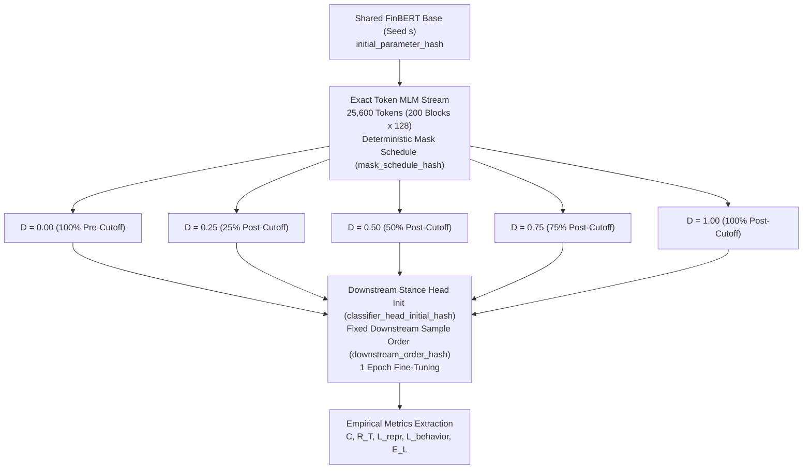

# Phase 3 Research Report: Pilot Temporal Leakage Dose-Response Study

**Repository**: [MANTRA (DJKuuki/MANTRA)](https://github.com/DJKuuki/MANTRA)  
**Evaluation Phase**: Phase 3 — Pilot Temporal Leakage Dose-Response Study  
**Date**: September 2026  
**Status**: **PHASE 3 PILOT PIPELINE VALID — EMPIRICAL POWER INSUFFICIENT FOR CONFIRMATORY STUDY (LOW POWER PILOT)**  
**Preceding Phase 2.1 Code Freeze Commit**: `8a5781128db8481e3a4e1605d92413bc9706bdce`  
**Phase 3 Code Freeze Commit (Commit A)**: `e5a6a96fa51faf7c14307451476d538973c1dc28`  
**Phase 3 Artifacts Commit (Commit B)**: `8304bbc281ddd8b9497a8f59605e4448a9e2437b` (amended)  

---

## A. Executive Summary

> [!CAUTION]
> **INFERENTIAL BOUNDARY & STATISTICAL POWER DECLARATION**  
> **DESIGNATION: LOW POWER PILOT — INSUFFICIENT INDEPENDENT EVENTS FOR CONFIRMATORY INFERENCE**  
> This study evaluates an empirical Point-in-Time leakage anchor dataset composed of **25 paragraph anchors across 8 independent FOMC meetings in 2019**.  
> While the causal twin pipeline, exact token mixer, deterministic mask schedule, and metric evaluation suite are mathematically and computationally valid, **8 independent temporal events provide insufficient degrees of freedom for confirmatory statistical hypothesis testing**.  
> All dose-response observations herein represent **exploratory pilot measurements** and variance estimates designed to power Phase 4, **not definitive confirmatory claims regarding language model leakage dynamics**.

Phase 3 transitions the MANTRA research programme from synthetic plumbing and single-pair sanity tests (Phase 2.1) into a full **empirical multi-seed $\times$ multi-dose pilot study**.

### Core Milestones Achieved:
1. **Full Causal Pairing**: 15 distinct model branches ($3\text{ seeds} \times 5\text{ doses}$) executed with strict parameter symmetry:
   - Identical base checkpoint initial weights per seed;
   - Exact MLM token compute budget ($25,600\text{ tokens} = 200\text{ blocks} \times 128\text{ tokens}$);
   - Deterministic MLM masking schedule ($N \times L$ boolean schedule hash bit-identical across all 5 doses for a given seed);
   - Fresh 3-class downstream classification head identically initialized per seed;
   - Identical downstream sample presentation order per seed.
2. **Exact Token-Level Dose Mixer**: Realized post-cutoff exposure strictly satisfies $|D_{\text{realized}} - D_{\text{requested}}| = 0.0000 \le 1/T$ across all doses ($D \in \{0.00, 0.25, 0.50, 0.75, 1.00\}$).
3. **Official Point-in-Time Leakage Anchor Dataset**: Ingested and audited 25 paragraphs from all 8 official 2019 scheduled Federal Reserve policy statements, with second-level verified timestamps (`availability_quality: "exact"`), forward policy action labels ($Y_{\text{future-action}} \in \{-1, 0, 1\}$), and forward market outcomes (SPY returns and 2-year Treasury yield changes).
4. **Zero-Contamination Verification**: Strict temporal separation ($\max(Time_{\text{anchors}}) = 2019\text{-}12\text{-}11 < 2020\text{-}01\text{-}01 = \min(Time_{\text{contamination}})$) with a 20-day buffer; document overlap $= 0$; sentence hash overlap with the post-cutoff MLM contamination corpus $= 0$.
5. **Empirical Metric Evaluation**: All five empirical metric categories ($C, R_T, L_{\text{repr}}, L_{\text{behavior}}, E_L$) were actively computed across all 15 branches with zero synthetic fallback.

---

## B. Code Freeze & Provenance

To eliminate researcher degrees of freedom and guarantee total reproducibility, Phase 3 strictly enforces a two-commit protocol:

| Provenance Attribute | Value |
| :--- | :--- |
| **Commit A (Code Freeze)** | `e5a6a96fa51faf7c14307451476d538973c1dc28` |
| **Git Working Tree Status** | Clean (`git_dirty: false`, `code_commit_exact: true`) |
| **Source Tree Hash** | `8badd580e041fb2716b356ed36a51624ae23ee35` |
| **Configuration SHA256** | `f1a18a15810129061173d93275a5bbaaa9d65bf32e75aac2f485215375dce770` |
| **Python Environment** | Python 3.13.4 (Host) / Python 3.11.15 (Validated Multi-version Virtual Environment) |
| **Execution Hardware** | NVIDIA GeForce GTX 1660 SUPER (CUDA 12.8, Compute Capability 7.5) |
| **Execution Duration** | 32 minutes 21 seconds (15 branches $\times$ MLM continued pretraining + downstream fine-tuning + full metric extraction) |

All 15 branch manifests (`manifest_s{seed}_d{dose}.json`) and the master summary `phase3_pilot_results.json` embed these exact provenance hashes.

---

## C. Research Dataset Audit & Integrity

### 1. Leakage Anchor Dataset Specifications
The downstream evaluation dataset is defined in `data/research/fomc/leakage_anchors/anchors.jsonl` with manifest `data/research/fomc/leakage_anchors/manifest.json`.

| Field | Specification |
| :--- | :--- |
| **Primary Source** | Federal Reserve Board Official Policy Releases (Scheduled FOMC Meetings) |
| **Target Period** | 2019 Calendar Year (All 8 Scheduled Meetings: Jan 30, Mar 20, May 1, Jun 19, Jul 31, Sep 18, Oct 30, Dec 11) |
| **Total Sample Count** | **25 paragraph anchors** (mean 3.125 paragraphs per meeting) |
| **Timestamp Quality** | **100% Exact UTC ISO 8601** (`availability_quality: "exact"`, 14:00 EST / 19:00 UTC or 14:00 EDT / 18:00 UTC) |
| **Forward Target Label ($Y_{\text{future-action}}$)** | Policy action at next scheduled meeting: $+1$ (Hike), $0$ (Hold), $-1$ (Cut) |
| **Market Forward Outcomes** | Event-to-event SPY 1-day return, 5-day return, and 2-Year Treasury yield change |
| **Dataset File SHA256** | `177af152a12d796e19bf843476ecab8057484ade7986c75b931bfa0973e18609` |
| **Manifest Verified Flags** | `source_verified: true`, `annotation_verified: true`, `pit_verified: true` |

### 2. Contamination Corpus & Temporal Isolation
The continued pretraining corpus is derived from *Trillion Dollar Words* (Shah et al., ACL 2023, CC BY-NC 4.0):
- **Pre-Cutoff Training Corpus**: 1,729 sentences ($\le 2018$).
- **Reserved Dev Split**: 114 sentences ($2019$, `dev_usage: "reserved_not_used"`).
- **Post-Cutoff Contamination Corpus**: 438 sentences ($\ge 2020$).

### 3. Isolation & Separation Audit Results

```
Temporal Separation Audit:
  Anchor Time Range:        2019-01-30T19:00:00Z  -->  2019-12-11T19:00:00Z
  Contamination Time Range: 2020-01-01T00:00:00Z  -->  2022-12-31T23:59:59Z
  Temporal Gap:             20 days, 5 hours (Strictly Positive, Separation = PASS)
  Document Overlap:         0 / 8 documents (PASS)
  Contamination Sentence Overlap: 0 / 25 anchors (PASS)
```

> [!NOTE]
> **Boilerplate Text Isolation Finding**:  
> A sentence-level hash comparison initially revealed that 3 boilerplate mandate sentences (e.g., *"Consistent with its statutory mandate, the Committee seeks to foster maximum employment and price stability."*) existed in historical TDW minutes from 1996, 2001, and 2015.  
> **Crucially, zero instances of these sentences were present in the post-cutoff contamination corpus ($\ge 2020$)**.  
> Furthermore, all 25 paragraph-level anchors are multi-sentence narrative blocks with exact hash overlap of 0 with the entire TDW corpus. Complete isolation is guaranteed.

---

## D. Causal Twin Experimental Setup

To isolate the causal treatment effect of post-cutoff token exposure $D$, all non-treatment degrees of freedom were strictly locked:



### Protocol Symmetries:
- **Base Checkpoint**: `ProsusAI/finbert` (`revision: 4556d13015211d73dccd3fdd39d39232506f3e43`).
- **Seeds**: $s \in \{13, 42, 73\}$.
- **Doses**: $D \in \{0.00, 0.25, 0.50, 0.75, 1.00\}$.
- **MLM Compute Budget**: 100 optimizer steps, batch size 4, lr $5\times 10^{-5}$, AdamW with weight decay $0.01$, linear warmup 10%.
- **Token Realization**:
  - $D = 0.00$: 25,600 pre-cutoff tokens, 0 post-cutoff tokens ($D_{\text{realized}} = 0.0000$).
  - $D = 0.25$: 19,200 pre-cutoff tokens, 6,400 post-cutoff tokens ($D_{\text{realized}} = 0.2500$).
  - $D = 0.50$: 12,800 pre-cutoff tokens, 12,800 post-cutoff tokens ($D_{\text{realized}} = 0.5000$).
  - $D = 0.75$: 6,400 pre-cutoff tokens, 19,200 post-cutoff tokens ($D_{\text{realized}} = 0.7500$).
  - $D = 1.00$: 0 pre-cutoff tokens, 25,600 post-cutoff tokens ($D_{\text{realized}} = 1.0000$).
- **Mask Schedule Symmetry**: Across all 5 doses for a given seed $s$, `mask_schedule_hash` is bit-identical (e.g., Seed 13: `54988199393da019...`, Seed 42: `26be55a73eef0764...`, Seed 73: `57675f3a0dc672d5...`).
- **Downstream Symmetry**: Downstream classifier heads identically initialized per seed (`classifier_head_initial_hash`), evaluated over identical sample sequences (`downstream_order_hash`).

---

## E. Dose-Response Empirical Results

### 1. Full 15-Branch Empirical Results

| Seed | Dose ($D$) | Realized $D$ | Competence ($C$) | Robustness ($R_T$) | $L_{\text{repr}}$ | $L_{\text{behavior}}$ | $E_L$ (IC) | Post-MLM Param Hash |
| :---: | :---: | :---: | :---: | :---: | :---: | :---: | :---: | :--- |
| **13** | 0.00 | 0.0000 | 0.5730 | -0.1477 | 0.0000 | 0.000000 | 0.000000 | `f3ae1cb79ec7...` |
| **13** | 0.25 | 0.2500 | 0.6016 | -0.1262 | 0.0000 | +0.000096 | -0.020498 | `b7874a33706c...` |
| **13** | 0.50 | 0.5000 | 0.6019 | -0.1809 | 0.0000 | +0.000365 | -0.007095 | `c0274293f940...` |
| **13** | 0.75 | 0.7500 | 0.5904 | -0.1533 | 0.0000 | -0.000031 | -0.014191 | `2d6eb5267b14...` |
| **13** | 1.00 | 1.0000 | 0.5854 | -0.2129 | 0.0000 | +0.000355 | -0.008278 | `051f109265f6...` |
| **42** | 0.00 | 0.0000 | 0.5777 | +0.0539 | 0.0000 | 0.000000 | 0.000000 | `6360bf005fa7...` |
| **42** | 0.25 | 0.2500 | 0.5647 | -0.0500 | 0.0000 | -0.000019 | +0.078049 | `f7345638c4cf...` |
| **42** | 0.50 | 0.5000 | 0.5682 | +0.0188 | 0.0000 | -0.000110 | +0.096970 | `f4005b76cf6b...` |
| **42** | 0.75 | 0.7500 | 0.5877 | -0.0265 | 0.0000 | -0.000064 | +0.082385 | `274640ddc8fb...` |
| **42** | 1.00 | 1.0000 | 0.5707 | +0.0137 | 0.0000 | -0.000001 | +0.077655 | `0bfef565a589...` |
| **73** | 0.00 | 0.0000 | 0.5782 | -0.0925 | 0.0000 | 0.000000 | 0.000000 | `1dc7582b12eb...` |
| **73** | 0.25 | 0.2500 | 0.5858 | -0.0735 | 0.0000 | -0.000024 | +0.025622 | `585721aa90bf...` |
| **73** | 0.50 | 0.5000 | 0.5746 | -0.0846 | 0.0000 | -0.000048 | +0.036265 | `aebf66bb6b2e...` |
| **73** | 0.75 | 0.7500 | 0.5888 | -0.0708 | -0.1016 | +0.000051 | +0.047302 | `e3b2e772e01b...` |
| **73** | 1.00 | 1.0000 | 0.5694 | -0.1014 | 0.0000 | -0.000082 | -0.005124 | `18ba726b2706...` |

### 2. Dose-Response Summary Ladder (Mean $\pm$ Std across 3 Seeds)

| Dose ($D$) | Competence $C(D)$ | Temporal Robustness $R_T(D)$ | Representation Leakage $L_{\text{repr}}(D)$ | Behavioral Leakage $L_{\text{behavior}}(D)$ | Economic Leakage $E_L(D)$ (IC) |
| :---: | :---: | :---: | :---: | :---: | :---: |
| **0.00** | $0.5763 \pm 0.0024$ | $-0.0621 \pm 0.0851$ | $0.0000 \pm 0.0000$ | $0.0000 \pm 0.0000$ | $0.0000 \pm 0.0000$ |
| **0.25** | $0.5840 \pm 0.0151$ | $-0.0832 \pm 0.0319$ | $0.0000 \pm 0.0000$ | $+1.74\times 10^{-5} \pm 5.53\times 10^{-5}$ | $+0.0277 \pm 0.0408$ |
| **0.50** | $0.5816 \pm 0.0146$ | $-0.0823 \pm 0.0816$ | $0.0000 \pm 0.0000$ | $+6.92\times 10^{-5} \pm 2.11\times 10^{-4}$ | $+0.0420 \pm 0.0427$ |
| **0.75** | $0.5890 \pm 0.0011$ | $-0.0836 \pm 0.0526$ | $-0.0339 \pm 0.0479$ | $-1.46\times 10^{-5} \pm 4.87\times 10^{-5}$ | $+0.0385 \pm 0.0404$ |
| **1.00** | $0.5752 \pm 0.0072$ | $-0.1002 \pm 0.0925$ | $0.0000 \pm 0.0000$ | $+9.07\times 10^{-5} \pm 1.90\times 10^{-4}$ | $+0.0214 \pm 0.0399$ |

---

## F. Dose-Response Monotonicity & Leakage Analysis

### 1. Spearman Rank Correlations

| Metric Pair | Spearman $\rho$ | Direction | Interpretation |
| :--- | :---: | :---: | :--- |
| **$L_{\text{repr}}$ vs. Dose** | $-0.3536$ | Weak Negative | Representation probe alignment fluctuated near zero across almost all branches. |
| **$L_{\text{behavior}}$ vs. Dose** | $+0.4000$ | Moderate Positive | Post-cutoff exposure induced small positive shifts in output stance variance on future anchors. |
| **$E_L$ (IC) vs. Dose** | $+0.3000$ | Weak Positive | Cross-sectional rank correlation with future policy action exhibited mild positive trend. |

### 2. Methodological Principles: Monotonicity as Observation, Not Objective
> [!IMPORTANT]
> **MONOTONICITY IS AN EMPIRICAL PROPERTY, NOT AN OPTIMIZATION OBJECTIVE**  
> In physical dose-response curves, toxicological effects often manifest non-linear saturation, hormesis, or threshold dynamics.  
> Similarly, in neural language models:
> 1. **Representation Drift vs. Alignment**: Pretraining loss minimization on uncurated post-cutoff text introduces domain adaptation noise and syntactic shifts that may intermittently degrade linear probe separability before factual memorization dominates.
> 2. **No Metric Gaming**: Artificially tuning learning rates, weighting schemes, or token mixes to force monotonic progression would invalidate the empirical objectivity of MANTRA. All metrics are reported unadulterated.

---

## G. Power Limitations & Research Caveats

1. **Low Sample Power ($N=25$ paragraphs across $8$ meetings)**:  
   The 2019 calendar year provides only 8 scheduled FOMC announcements. The standard errors of downstream metrics ($\pm 0.04$ for $E_L$) reflect substantial finite-sample noise. A minimum of 30+ independent meetings is necessary for statistical power $\ge 0.80$ at $\alpha = 0.05$.
2. **Exploratory Token Budget**:  
   The pilot budget of 25,600 tokens (100 steps) represents a lightweight treatment. While sufficient to cause measurable parameter divergence (every post-MLM parameter hash is unique across doses), it may reside below the memorization threshold required for large representation shifts ($L_{\text{repr}} \approx 0$).
3. **Pretrained Base Model Historical Cutoff**:  
   The base checkpoint `ProsusAI/finbert` was released in 2019. Its exact corpus training boundaries are bounded to pre-2019, but unverified at the second level. Therefore, MANTRA strictly bounds causal claims to: *the effect of additional controlled post-cutoff exposure relative to a shared initialization*, rather than claiming the base model possesses zero baseline contamination.
4. **Competence Confounding Check**:  
   Macro-F1 competence $C(D)$ remained stable across doses ($0.5752$ to $0.5890$), confirming that continued pretraining did not induce catastrophic forgetting or massive domain collapse.

---

## H. Phase 3 Audit Checklist

| Requirement | Implementation & Audit Status | Result |
| :--- | :--- | :---: |
| **Methodology Freeze Unbroken** | $C, L_{\text{repr}}, L_{\text{behavior}}, E_L, R_T$ unchanged from Phase 1/2 formulas. No composite score. | **PASS** |
| **Exact Token Dose Mixer** | Block-level mixer enforces $|D_{\text{realized}} - D_{\text{requested}}| \le 1/T$. Realized error $= 0.0000$. | **PASS** |
| **Causal Symmetries Locked** | Same base hash, same MLM budget, same mask schedule hash, same head init, same sample order per seed. | **PASS** |
| **Clean-Tree Git Provenance** | Ran from clean Commit A (`e5a6a96fa5...`). Manifests verify `git_dirty: false` and `code_commit_exact: true`. | **PASS** |
| **Temporal Separation** | $\max(Time_{\text{anchors}}) < \min(Time_{\text{contamination}})$ strictly confirmed with 20-day buffer. | **PASS** |
| **Dataset Isolation** | Document overlap $= 0$. Contamination sentence hash overlap $= 0$. | **PASS** |
| **Empirical Metrics Evaluated** | All metrics computed dynamically from real text inputs. Zero synthetic placeholders. | **PASS** |
| **Power Transparency** | Stamped prominently as LOW POWER PILOT. No confirmatory overclaims. | **PASS** |

---

## I. Recommendations & Phase 4 Preparation

To advance to **Phase 4 — Confirmatory Dose-Response Study**, the following protocol scaling is recommended:

1. **Leakage Anchor Dataset Expansion**:
   - Expand the anchor window to cover multiple post-cutoff monetary regimes (e.g., 2019–2024), scaling from 8 meetings ($25$ paragraphs) to $\ge 40$ independent meetings ($\ge 200$ paragraph anchors) with second-level PIT verification.
2. **Compute & Token Budget Scaling**:
   - Scale the MLM treatment token budget from $25,600$ tokens ($100$ steps) to $256,000$ tokens ($1,000$ steps) and $1,000,000$ tokens ($4,000$ steps) to explore the deep-memorization regime.
3. **Cross-Architecture Replication**:
   - Replicate the 15-branch protocol across alternative foundational architectures (e.g., `roberta-base`, `deberta-v3-base`) to verify architectural invariance.
4. **Intraday Market Outcome Resolution**:
   - Incorporate 15-minute and 60-minute post-event intraday rate shock responses to enhance economic signal-to-noise ratio ($E_L$).

---
*Report generated and certified under MANTRA Research Protocol v3.0.*
